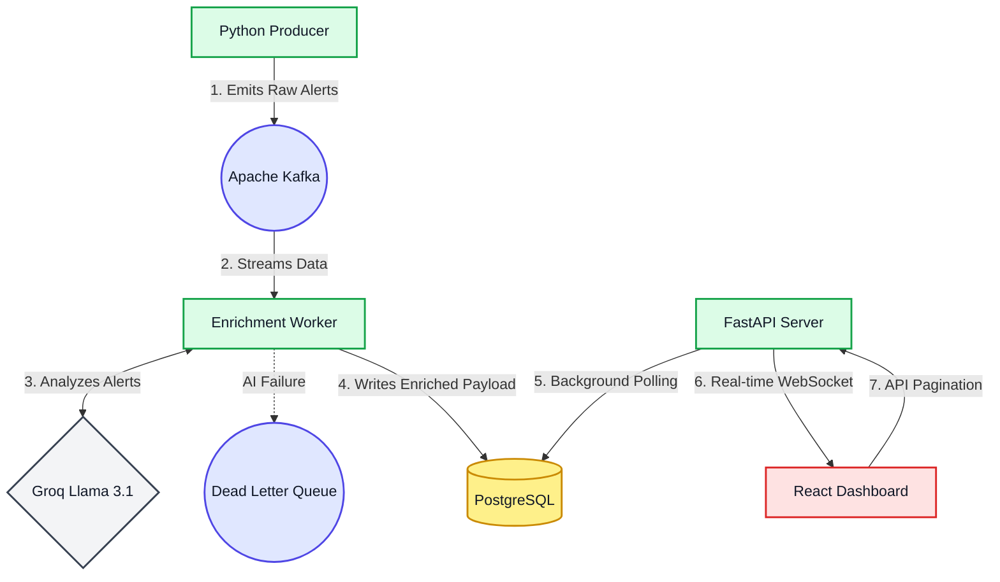

# 🚨 SRE Incident Intelligence Pipeline

[](https://sre-incident-intelligence.vercel.app/)
[](#-launching-locally-docker)
[](#-production-deployments-cicd)



An event-driven, real-time analytics pipeline designed to ingest, process, and enrich site reliability incidents using LLMs (Large Language Models).

This project simulates a live production environment where messy, unstructured alerts are parsed securely via Groq's Llama 3.1 models and piped dynamically to a responsive React dashboard. 

## 🏗️ Architecture & Code Organization

The platform is designed around a highly decoupled microservice architecture spanning from local development entirely to multi-cloud Continuous Deployment (CD). 

### 1. Data Ingestion & Streaming
- **`producer/` (Incident Factory)**: A resilient Python publisher leveraging the `Faker` library to generate synthetic systemic failures (e.g., `ConnectionTimeout`, `503 Bad Gateway`). It strictly publishes raw JSON payloads continuously to an Apache Kafka broker (`raw-incidents` topic). The producer is dynamically throttled to carefully respect downstream AI rate limits.
- **Apache Kafka & Zookeeper**: The primary Pub/Sub messaging layer gracefully handling the asynchronous buffering. Locally hosted via Confluent Docker images ensuring horizontal scalability constraints are maintained and zero messages are dropped during data spikes.

### 2. Intelligent Processing Engine
- **`enrichment-worker/`**: A background Python consumer configured to actively poll Kafka for raw incidents. It utilizes the **Groq LLM API (Llama-3.1-8b)** to automatically digest unstructured IT logs, accurately deduce the root cause, assign an explicit prioritization severity (e.g., `CRITICAL`, `HIGH`), and construct immediate, actionable remediation steps. 
  - *Resiliency Protocols*: The worker natively embeds exponential backoff logic guaranteeing recovery during 429 HTTP rate limit strikes. If the LLM organically hallucinates or formatting completely shatters, it autonomously isolates the corrupted payload, shunting it to a Dead-Letter-Queue (`DLQ`) to maintain pipeline integrity.

### 3. Backend Routing & Persistence
- **`api/` (FastAPI Server)**: A high-performance Python ASGI backend bridging the intelligence worker to the frontend clients. It manages rigorous native ORM mapping to PostgreSQL for persistent historical querying via optimized REST pagination limits.
- **WebSocket Broadcasting**: Employs an active bi-directional WebSocket architecture seamlessly pushing fresh LLM incident deductions instantly to attached client browsers with zero polling latency.
- **PostgreSQL**: Robust persistence layer firmly guarding enriched incident payloads. Configured structurally via `psycopg2` within the backend for high-availability.

### 4. Interactive Frontend
- **`dashboard/` (React & Vite)**: An ultra-fast, dynamic React view structurally painted using modern **Tailwind CSS**. It securely intercepts live WebSocket streams to animate incident cards instantaneously across the screen. Additionally, it implements responsive navigation allowing human operators to filter severity limits and elegantly paginate deeply into historical Postgres outages via standard Axios HTTP polling.

### 5. Automation & Multi-Cloud Deployment
The codebase enforces professional software life-cycles leveraging native **CI/CD**:
- **Continuous Integration (GitHub Actions)**: Every commit pushed to the repository unconditionally fires an isolated `pytest` framework executing inside pristine Ubuntu containers. This universal shell sequence intrinsically simulates the Groq LLM API and intercepts Database queries minimizing physical pipeline crashes. It guarantees zero regressions escape to production.
- **Continuous Deployment (GHCR)**: Upon testing stability, Action runners containerize the four underlying components dynamically pushing Docker footprints exclusively into the GitHub Container Registry secured flawlessly against their Git Commit SHAs.
- **Live Infrastructure (Render & Vercel)**: 
  - **Render**: Extensively hosts the automated Python backend execution layers and attached PostgreSQL clustering directly listening to branch merges.
  - **Vercel**: Anchors the compiled React Vite frontend immediately deploying ultra-fast edge CDNs internationally on demand automatically coupled strictly to GitHub releases.

---

## 🚀 Tech Stack Highlights
- **Languages**: Python 3.12, JavaScript (Node.js)
- **Frontend Core**: React, Vite, Tailwind CSS v4
- **Backend Architecture**: FastAPI, Uvicorn, Psycopg2
- **Data & PubSub Brokers**: PostgreSQL 15, Apache Kafka / Zookeeper (Confluent Platform)
- **AI / LLM Parsing**: Groq API (Llama-3.1-8b)
- **DevOps Ecosystem**: Docker, Docker Compose, GitHub Actions, Vercel, Render

---

## 🛠️ Setup Guide

### 1. Prerequisites
- [Docker & Docker Compose](https://www.docker.com/products/docker-desktop) inherently active on your host machine.
- A free developer API key from native [Groq Consoles](https://console.groq.com/keys).

### 2. Environment Configuration
Create a secure `.env` file mapped specifically in the root directory formatting your Groq keys locally:
```env
GROQ_API_KEY=gsk_your_api_key_here
```

### 3. Launching Locally (Docker)
Because the entire application infrastructure mirrors production identically on isolated container sub-nets, launching the pipeline globally takes a single command routed from your root directory:
```bash
docker compose up --build
```
*Docker will sequentially spin up Zookeeper, Kafka, Postgres, the FastAPI server, the Python Enrichment Worker, the Producer, and the React Dashboard seamlessly. Automatic Healthchecks ensure the containers execute with perfect boot-ordering blocking database crashes.* 

### 4. Viewing the Interactive Dashboard
Once Docker successfully evaluates all internal health checks (roughly 15-20 seconds overhead), navigate via any browser uniquely to:
👉 **[http://localhost:5173](http://localhost:5173)**

---

## 🧪 Testing Locally

To natively evaluate all microservice Python pipelines locally without spinning up Docker configurations manually execute the universal testing sequence recursively checking schemas:
```bash
chmod +x run_tests.sh
./run_tests.sh
```
